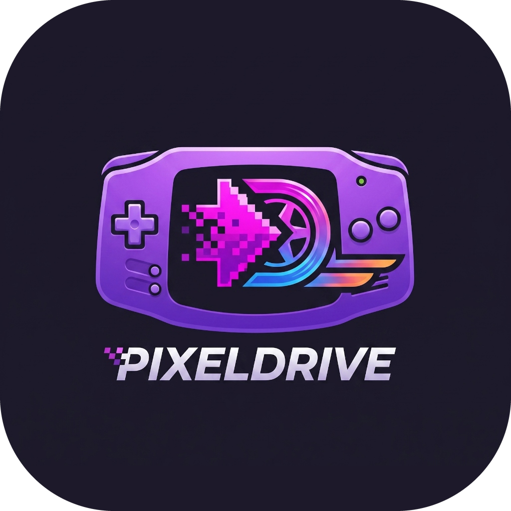

<p align="center">
  
</p>

<h1 align="center">🕹️ PixelDrive</h1>

<p align="center">
  <strong>A modern, high-performance Game Boy (GB / GBC) and Game Boy Advance (GBA) emulator built in Rust.</strong>
</p>

<p align="center">
  <a href="#-features">Features</a> •
  <a href="#-installation--quickstart">Installation</a> •
  <a href="#-controls--hotkeys">Controls</a> •
  <a href="#-architecture">Architecture</a> •
  <a href="#-packaging">Packaging</a> •
  <a href="#-legal-disclaimer">Legal</a> •
  <a href="#-license">License</a>
</p>

---

## ✨ Features

- **Multi-System Dual-Core Architecture:**
  - **Game Boy / Game Boy Color:** Native cycle-accurate pure-Rust emulation core featuring full 4-channel APU audio synthesis, MBC1/2/3/5 cartridge banking, and accurate PPU rendering.
  - **Game Boy Advance:** High-performance dynamic Libretro core bridge (`libloading`) supporting official `mgba_libretro` dynamic libraries.
- **Hardware-Accelerated Rendering (WGPU):**
  - Cross-platform GPU backend supporting Metal (macOS), Vulkan (Linux/Windows), and DirectX 12.
  - **Real-Time WGSL Shaders:** Instant cycling between Nearest-Neighbor integer scaling, authentic LCD subpixel grid lines, and GBA color correction tone curves.
- **Low-Latency Audio Engine:**
  - Real-time stereo audio pipeline powered by **cpal** with lock-free ring buffering (`ringbuf`).
  - High-precision Catmull-Rom cubic Hermite spline resampler and 2nd-order Butterworth lowpass filter.
- **Save Management & Persistence:**
  - **Battery Saves (`.sav`):** In-game cartridge RAM automatically flushes to `./saves/<rom_name>.sav`.
  - **Real-Time Save States:** Persistent multi-slot state snapshots saved to disk (`./saves/<rom_name>.state<slot>`) with instant Quick Save / Quick Load.
- **Modern On-Screen Display (egui Overlay):**
  - Native menu bar with File Dialog loading, shader selector, save slot manager, audio mute toggle, and live FPS/T-cycle diagnostic HUD.

---

## 🚀 Installation & Quickstart

### Option 1: macOS Disk Image Installer (.dmg)
Download the latest `PixelDrive-1.0.0.dmg` from the **[Releases](../../releases)** page:
1. Open `PixelDrive-1.0.0.dmg`.
2. Drag **PixelDrive.app** into your **Applications** folder.
3. Launch PixelDrive from Launchpad or Finder.

### Option 2: Build from Source (Cargo)

Ensure you have [Rust (stable)](https://rustup.rs/) installed:

```bash
# Clone the repository
git clone https://github.com/AshXtreme/pixel-drive.git
cd pixel-drive

# Run PixelDrive directly
cargo run --release

# Or launch directly with a ROM file:
cargo run --release -- path/to/game.gba
```

---

## 🎮 Controls & Hotkeys

### Gamepad Controls (Player 1)

| Game Boy / GBA Key | Keyboard Key |
| :--- | :--- |
| **D-Pad Up / Down / Left / Right** | `W` / `S` / `A` / `D` or `Arrow Keys` |
| **A Button** | `K` / `Z` |
| **B Button** | `J` / `X` |
| **L Shoulder** (GBA) | `Q` / `U` |
| **R Shoulder** (GBA) | `E` / `I` |
| **Start Button** | `Return` (Enter) |
| **Select Button** | `Backspace` / `Shift` |

### System & Emulator Hotkeys

| Action | Hotkey |
| :--- | :--- |
| **Toggle Menu Bar (OSD)** | `Esc` |
| **Toggle Fast-Forward (2x Speed)** | `Tab` |
| **Toggle Audio Mute** | `M` |
| **Cycle Video Shaders** | `F4` (Nearest $\rightarrow$ LCD Grid $\rightarrow$ Color Correction $\rightarrow$ LCD+Color) |
| **Quick Save State** | `F1` (Saves to active slot) |
| **Quick Load State** | `F2` (Loads from active slot) |
| **Select Save Slot (1–9)** | `1` – `9` |
| **Pause / Resume Simulation** | `P` |
| **Reset Core Simulation** | `R` |

---

## 🏛️ Architecture & Codebase Layout

```text
PixelDrive/
├── assets/                 # High-resolution icons and macOS metadata
│   ├── macos/              # AppIcon.icns & Info.plist
│   └── icon.png            # Master 1024x1024 application logo
├── cores/                  # Dynamic Libretro core libraries (e.g. mgba_libretro.dylib)
├── saves/                  # Persistent battery saves (.sav) and save states (.state1..9)
├── scripts/                # Packaging and release automation scripts
│   ├── build_macos_dmg.sh  # Standalone macOS .app bundle & .dmg installer generator
│   └── package.sh          # Cross-platform release tarball packager
├── src/
│   ├── main.rs             # Event loop, WGPU/Pixels setup, input dispatch, timing
│   ├── core/               # Shared EmulatorCore trait, Button matrix & system enums
│   ├── gbc/                # Native Game Boy / Game Boy Color core
│   │   ├── cpu.rs          # LR35902 8-bit Z80-derivative CPU & opcode decoder
│   │   ├── mmu.rs          # 16-bit memory bus, VRAM/WRAM banking, DMA/HDMA
│   │   ├── ppu.rs          # Pixel Processing Unit (Modes 0-3, palettes, OAM sprites)
│   │   ├── mbc.rs          # Cartridge controllers (ROM Only, MBC1, MBC2, MBC3, MBC5)
│   │   ├── apu.rs          # 4-channel audio synthesizer (Square 1/2, Wave, Noise)
│   │   └── joypad.rs       # Active-low joypad matrix
│   ├── gba/                # Game Boy Advance emulation layer
│   │   ├── libretro.rs     # FFI Libretro dynamic bridge with AV & input callbacks
│   │   ├── cpu.rs          # ARM7TDMI 32-bit CPU core & mode registers
│   │   ├── arm.rs          # ARM instruction decoder & barrel shifter
│   │   ├── thumb.rs        # 16-bit THUMB instruction decoder
│   │   ├── mmu.rs          # 32-bit GBA memory map, DMA controller & Flash/SRAM
│   │   ├── ppu.rs          # GBA PPU with Modes 0-5 bitmap and affine backgrounds
│   │   ├── bios.rs         # SWI BIOS routines & HLE fallback
│   │   └── keypad.rs       # GBA KEYINPUT 10-button active-low matrix
│   ├── render/             # Hardware-accelerated rendering & video shaders
│   │   ├── mod.rs          # WGPU ShaderPipeline controller & render pass
│   │   └── shaders.rs      # WGSL shaders (Nearest, LCD Grid, Color Correction)
│   ├── audio/              # Low-latency CPAL stereo audio engine & lock-free ring buffer
│   ├── save.rs             # Battery save (.sav) & state snapshot manager (.state1..9)
│   ├── ui/                 # egui OSD overlay, top menu bar, and live HUD
│   └── error.rs            # Unified PixelDriveError enum with thiserror
├── Cargo.toml              # Dependencies and release optimization profiles
├── LEGAL.md                # Legal disclaimers and trademark acknowledgments
├── SECURITY.md             # Security policy and vulnerability disclosure guidelines
└── LICENSE                 # GNU General Public License v3.0 (GPL-3.0)
```

---

## 📦 Packaging & Build Automation

### Generate macOS DMG Installer:
```bash
./scripts/build_macos_dmg.sh
```
Produces `dist/PixelDrive-1.0.0.dmg` with `/Applications` drag-and-drop symlink.

### Generate Cross-Platform Release Package:
```bash
./scripts/package.sh
```
Produces `dist/PixelDrive-Release.tar.gz` containing stripped binaries, documentation, assets, and core directories.

---

## 🧪 Testing & Verification

Run the full unit and integration test suite:

```bash
cargo test -- --test-threads=1
```

Run clippy for static analysis with zero warnings:

```bash
cargo clippy --all-targets -- -D warnings
```

---

## ⚖️ Legal Disclaimer

**PixelDrive** is an independent open-source emulator project developed solely for educational and archival preservation purposes. PixelDrive is **NOT** affiliated with, authorized, endorsed, or sponsored by **Nintendo Co., Ltd.**, **Nintendo of America Inc.**, or any of their subsidiaries.

- **No ROMs Included:** PixelDrive does **not** provide, bundle, or distribute proprietary BIOS files, copyrighted ROMs, or game assets.
- **Trademarks:** "Game Boy", "Game Boy Color", and "Game Boy Advance" are registered trademarks of Nintendo Co., Ltd. Mentioned solely for nominative descriptive identification under Fair Use principles.

For complete legal information, see [LEGAL.md](LEGAL.md).

---

## 📄 License

This project is licensed under the **GNU General Public License v3.0 (GPL-3.0)**. See the [LICENSE](LICENSE) file for details.
